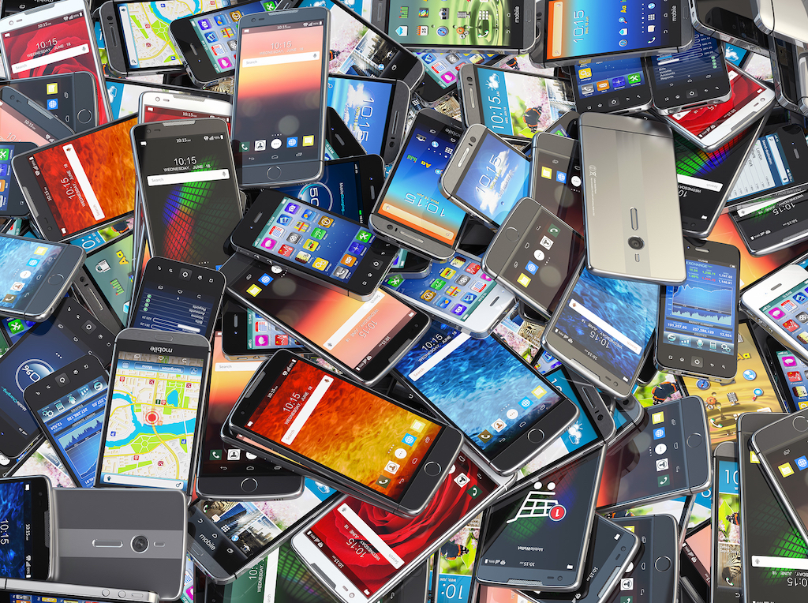
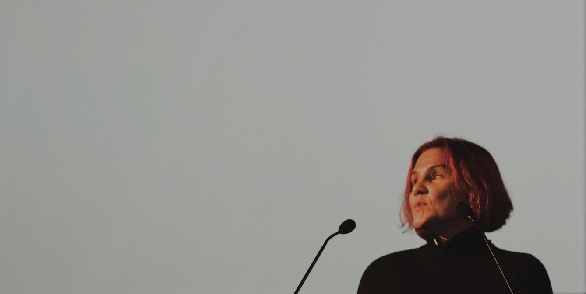

Theme: Fira, 3
<!-- footer: @sophdex @maxbarners -->

## **Inclusive Design:**
## More 💛, more humans

<!-- TODO: make a bigger deal of overlapping disabilities? -->

---

## Disability is a spectrum, not a binary

^ S: Most important thing from this talk
This will help you be a superhero to your users
It'll help you have more humans, on more devices and browsers, under more conditions
Inclusive Design is a powerful tool thing that will help you do this

---

^ We understand, or are coming to understand, that screen size is a spectrum
with responsive web design and CSS grid
We'll see that (Dis)ability is a spectrum, like this

---

## Did anyone notice something weird on the walls?

## **bit.ly/emplab301**

^ N: Start as we mean to go on :D
If you didn’t see anything, go to that URL later. We'll post it in the meetup comments
It's some Inclusive Design myth-busting

---

## **Us looking at our stuff**

## 😢 ➜ 😡 ➜ 😄

## #truestory

^
S: That was us, in 2017, looking at some of things we’d designed and built.
We realised it wasn't our best work: it wasn't accessible. We'd made some bad assumptions.
We got sad. Then we got angry. Then we rolled up our sleeves and got to work - we started thinking about how we could do our work better, and help other people to do the same.

---

## **The Empathy Labradors**

## [fit] Nicola du Toit - @sophdex

## [fit] Steve Barnett - @maxbarners

^ N: So we became the Empathy Lab, and because we like dogs (and cats!) the Labrador bit kinda stuck...

^ S: As the Empathy Labradors, we do Inc Des ourselves, with our teams, and do talks and workshops about it to share the love

^ N: So this is Steve. He’s a Front-end developer and User Experience consultant. He loves applying User-Centered Design principles to Front-end development.

^ S: Nicola. She’s a UX designer and usability specialist by day and a musician by night. She firmly believes that human-centred design can make the world a better place.

---

^ N: Our local govt's site.
as someone designed it.

---

^ S: screen reader
or reader view

---

^ N: common colour blind
// deuteranopia

---

^ S: forgot my glasses

---

^ N: sunny outside

---

 
 

^ S: we design and develop mostly in one way
in the dev world we say: works on my machine!
but when our work is out in the world, yhu, it gets experienced in **a lot** of different ways

---

## **1. Disability as a spectrum**
## 2. The What and the Why
## 3. The How

^ S: At the end, you'll have three things you can do to start designing more inclusively. That's a mouthful.

---

## Ability + Barrier = Disability

^ S: Different, social definition of disability
Functional capacity + Barrier
(Barrier e.g.s come after the activity!)
A Disability occurs when the product creates a barrier to access
From a book called "A Web For Everyone"
World Health Organisation: interaction between person’s body and their society
barriers: environmental, social, more

---

^ N: This is the first web site, from 1991. Yeah, looks like shit, but it fucking works!
- No barriers - no impairments, activity limitations, or participation restrictions (access/usage/functionality)
- Accessible
- Responsive too!
- What we'll see shortly is that all the shiny shit we add can limit people's abilities to use our stuff and therefore create barriers.

---

## Get ready to stand up…
## 💃 🕺

<!--
## **Please be standing up...** (yes, really) 
## 💃 🕺

^ S: We're trying something new
Normally we ask people to write on the posters
Thank you for your co-operation
-->

---

## **Experienced this?**
## Friend? 👯 Parent? 👵 Colleague? 👷
## **Draw a ❤**

^ N:
- We've got some examples of differing physical and cognitive  abilities up on those posters. Think about how you or someone you know might have experience of these.  Go up and draw a heart on any capabilities (or lack thereof) that are relevant to you.

---

## Disability is a spectrum, not a binary

^ S: Thank you for your co-operation!
Talk through the thing
Show of hands for some of the popular ones
Ask them to look around at all the hands up: lots of us!
Permanent, Temporary, Contextual,
Usually a human has more than one at a time

^ N: The same barrier can be magnified and be worse for someone starts out with different abilities to you.
So bad colour contrast might be frustrating for me, but for someone who is colourblind it can make things illegible.
^ Let's try and avoid adding barriers to users with differing abilities, by doing gooder, more inclusive design.

---

> “The power of the Web is in its universality. Access by everyone regardless of disability is an essential aspect.”
-- Tim Berners-Lee

^ N: Anyone know TBL? He's the bloke that built the web. Web was a proposal for an information management system to his boss. The boss's comments were "vague, but exciting" (true story!)
“Web Developer”
Tim says that anyone with (all of) these functional capabilities should be able to access our stuff online.
**An essential aspect** of the internetz

---

## **Examples of barriers 🚧**
## Complex content
## Precise controls
## Low contrast

^ S: Cognitive: jargon or unnecessarily complex content or hifalutin' fancy wording
Physical: UI that requires a mouse, or precise controls.
Visual: Low contrast.
(We'll come back to these later)

---

<!--
## There are other spectrums we could consider too

^ S: bee tee dubs
Outside the scope of this talk, but...
🗣 Shout outs: like what? Any ideas?
Device: Screen, Hardware, Browser
Network: Latency, Speed, **Cost**
Environmental

---

## **Device**
## Screen
## Hardware
## Browser

^ Screen: size, resolution, shatters
Hardware: new and shiny, old and crappy and slow
Browser: could be Chrome on iOS or an old IE at work

---

## **Network**
## Speed
## Latency
## Cost

^ Could be fast connection with awful latency
Could be someone buying data out of bundle
Any of these could create a barrier to access, to use

---
-->

## ~~1. Disability as a spectrum~~
## **2. The What and the Why**
## 3. The How

^ N: any questions about disability as a spectrum?
Let's talk about what inclusive design is.

---

## **❤ Inclusive Design**
## is designing for the (for reals) diversity of our users

^ S: Inc design = designing for the diversity of our users.
It's the process of making conscious decisions to check our assumptions about who is and isn't our audience,
what abilities they have or don't have
lots of the disabilities are invisible. Won't show up in analytics or stats
(point at barriers activity)

---

## **❤ Accessibility**
## is the implementation
## (Google these: WCAG, WAI-ARIA)

^ N: IncDesign is closely related to accessibility, which is specifically about designing for people with disabilities.
- There is great documentation available online detailing how we should build our stuff to make it accessible.
- Two sets of guidelines worth Googling: Web Content Accessibility Guidelines & Web Accessibility Initiative-Accessible Rich Internet Applications Suite
- WCAG gives guidelines for AA- and AAA-level accessibility

---
## **P**erceivable
## **O**perable
## **U**nderstandable
## **R**obust

^ More specifically
WCAG Principles of accessibility

^ At the most basic level, users must be able to process and perceive information. They need to be able to operate websites and applications with a variety of tools. If users can perceive and operate a website, that doesn't mean they can understand it. Understandable websites use clear, concise language and offer functionality that is easy to comprehend. And users pick their own mix of technologies. Within limits, websites should be robust enough to work well-enough across platforms, browsers, and devices to account for personal choice and user need.

---

## **❤ Inclusive Design**
## means good usability

^ N: Inc design is also about good usability. We aren't making things that are "just pretty." We're making things that look good and work well. We want to get out of the way and let the user do what they came to do
^ UX paradox: if we've done our job well, our work becomes invisible.
^ ? Talk about how this makes our job difficult

<!--
---

## **❤ Inclusive Design**
## is about being agile

^ Show of hands ✋: who does agile?

---

> Continuous attention to technical excellence
and good design enhances agility.
-- One of the principles behind the Agile Manifesto

^ Technical excellence is code that works for all your users
Good design is unobtrusive, makes a product useful (Dieter Rams)

---

## **❤ Inclusive Design**
## means quality software

^S: quality meaning technically good
// “Build the thing right”
Structurally sound?
Functionally sound?
Is it ship-shape?

-->

---

<!--
## **Why should we care? 🤔**
## What are the benefits of doing Inclusive Design?

^ N: Okay, now we know what it is. So what? Why even do this? What's in it for us? What's in it for the pointy-haired bosses?

---
-->

## **❤ Inclusive Design**
## helps us be superheros
#### (Wakanda Forever!)

^ N: in the best case scenario, we can make an unusable thing become usable for someone.
in the worst case, we make our stuff just a little bit easier to use.
so it's a win win!
IncDesign is the right, the ethical thing, to do. What would Black Panther do?

---

<!--
## **❤ Inclusive Design**
## helps us avoid (expensive) fixes later (and possibly lawsuits)

^ S: It's also cheaper to fix earlier
Being sued is double plus ungood
At the mo', US and UK and Europe. Here soon, prolly.

---

## **❤ Inclusive Design**
## helps us get more humans, on more devices, under more conditions

^ N: more customers & happier customers
more money for us if capitalism is your vibe 😬
better experiences all round, if altruism is your thing.

---

## **Why should we care? 🤔**
## Isn't accessibility (and Inclusive Design) boring, and limiting? And also: boring? 😴

^ S: Does this mean I have to make everything like The First Web Site?
We think "No!" Phoenix Wright finger pose
Here's why.

---
-->

## **❤ Inclusive Design**
## provides constraints, which spark creativity

^ S: If you can do a good job under hard constraints, that makes you a "whoa" and "dayyum" designer
Shout out: some examples of constraints for the abilities activities over yonder
Cognitive: plain language
Physical: keyboard controls
Visual: colour contrast

<!--
E.g. "Design me a website" is hard.
"Design me a website for hamster fans" is easier.
"Design me a website for coffee-drinking hamster fans in Cape Town." is easiest. Sort of.
-->

---

## **❤ Inclusive Design**
## helps us design for (imperfect) reality

^ N: People **are always** going to use our stuff in ways we don't expect. (extreme ironing case in point)
We shouldn't just be designing a single version of a site that's just for a shiny portfolio
We should be designing robust, flexible products for a messy, unpredictable world. (like the opening screenshots)
Durable and flexible UX speaks volumes about our values - we're not just talking about user-centredness, we're demonstrating it too.

---

## **❤ Inclusive Design**
## asks us to have the confidence and the kindness to be a little boring

^ S: And okay, maybe sometimes it is a little boring. Less shiny, less shouty.
Confident enough to say "the right thing here isn't the shiny thing. It's the standard bit of UI. That's what's best for our users."
Lead by design example, inspire others to do the same. This can be groundbreaking - the opposite of boring!
This is one I still struggle with selling.

---

<!--
## What was the most surprising thing in **The What and the Why**?
## Use your words 🗣

^ S: Okay, that was a lot of stuff.
Shout outs: what was the most surprising thing for you in the What and the Why?
(We repeat to the audience)

---
-->

## ~~1. Disability as a spectrum~~
## ~~2. The What and the Why~~
## **3. The How**

^ S: Any questions about the what and the why?
Final section. Practical stuff you can do **now**.
Well, after the talk. Don't do it **right now**.
That'd be weird and awkward.

---

## **How do we do Inclusive Design?**
<!-- ## What do we test? -->
## How do we check?

^ N: Show of hands ✋: what do people do?
Designers? Devs? Managers? Something else?

^ Doing Inclusive Design is a team sport
Here are three examples of things you can check
Maybe be familiar from before (barriers)

---

<!-- ## **Test for** -->
## **Cognitive disability**
## Check for plain language

^ S: People’s home language can be different to the one your content is written in. People with cognitive difficulties like dyslexia struggle with long or complex content.
Specifics: Readability / reading level, sentence length, paragraph length.
Story: Seen confusion with "address 1, address 2" vs "number and street, suburb".
We'll share a link with you in a mo for plugins etc to help you test things.

---

<!-- ## **Test using** -->
## **Physical disability**
## Check without using a mouse or trackpad

^ N: People with physical impairments (and power users!) use a keyboard instead of a mouse as it doesn’t require precise movements.
Specifics: If you tab through the elements on a webpage, can you move the cursor focus around in a sequence that makes sense?
Story: Gran and an example of her getting stuck.

---

<!-- ## **Test** -->
## **Visual disability**
## Check the colour contrast

^ S: People with visual disabilities need information that has sufficient colour contrast and information that isn’t represented only in colour.
Anyone on a dodgy screen, or out in the sun
Specifics: contrast ratio of background and text colours.
Story: UI Designer seeing the light grey on grey on an external monitor. Worked together to fix it.
We'll give you links for some tools.

---

## "This sounds like a lot of work"
## 😱

^ N: So, this sounds like a lot of work.
And it kind of is. If you want to fix it all.
But.

---

> “It doesn't have to be perfect, just a little bit better than yesterday"
-- Leonie Watson

^ S: At a conference
Leonie is Accessibility engineer, W3C Web Platform WG co-chair, Speaker at many cons
Oh, and btw, she's blind
She really knows what she's talking about
Small changes:
- add up over time
- easier to do
- easier to "sell" to bosses and clients

---

## Disability is a spectrum, not a binary

^ N: Because disability is a spectrum, even small, iterative improvements will improve your stuff for people. It's ok to take many small steps in the right direction.

---

## 1. ~~Disability as a spectrum~~
## 2. ~~The What and the Why~~
## 3. ~~The How~~

---

<!--
## **Now what?**
## Tomorrow is Global Accessibility Awareness Day
### globalaccessibilityawarenessday.org or google GAAD

^ S: happens every year
workshops around the world
We ran one in Cape Town last weekend

---
--->

## **Now what?**
## Tomorrow, 10am, 10 mins
## Test your stuff
## **bit.ly/emplab-ten-at-ten**

^ N: Tomorrow at 10am spend 10 mins testing your stuff.
Pick one thing that you can tweak and make better! We’ll post this link in the meetup.
It’s three short activities for the three checks we mentioned a moment ago. Pick one!
Think of someone you (drew a heart for) stood up for at the beginning, choose the activity that's closest to them.

---

## **Pair up with someone**
## Tell them: "I'm going to spend 10 minutes testing my stuff tomorrow."
## 👍 or ✋

^ S: Thumb up or hive five
Celebratory hand gesture of your choice
"Noice!"
Is this silly? Yes.
Will it increase your chance of doing it slightly? Also Yes.

---

<!--## **Thanks! Questions?**  -->
## **Thanks! 🙇**  

## [fit] Nicola du Toit - @sophdex

## [fit] Steve Barnett - @maxbarners

## **bit.ly/emplab-ten-at-ten**

^N: Thanks and questions?
